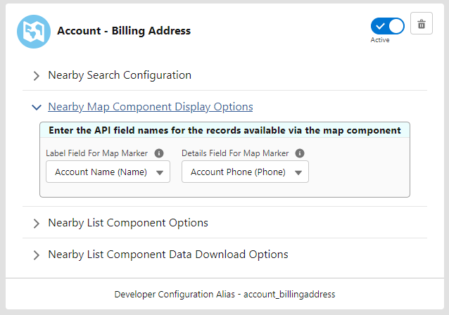
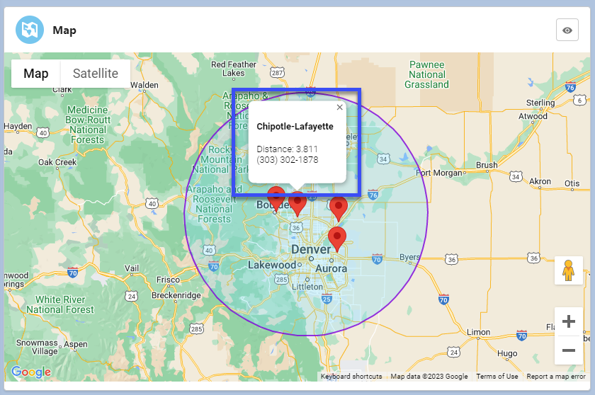
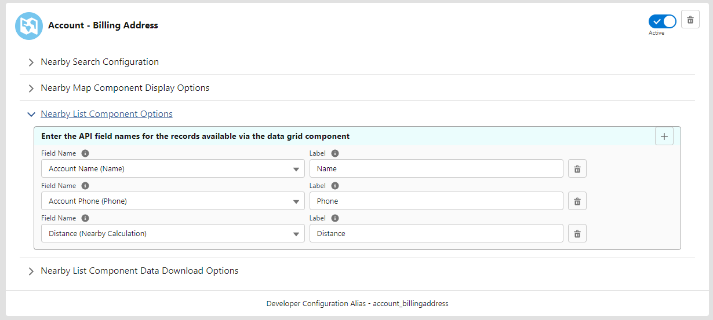
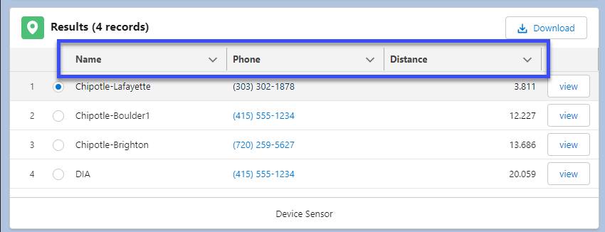
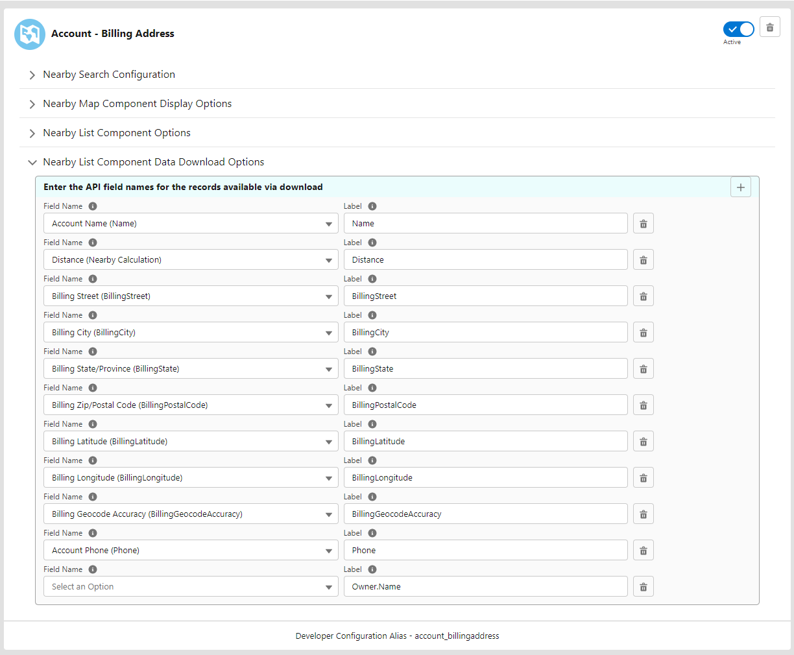
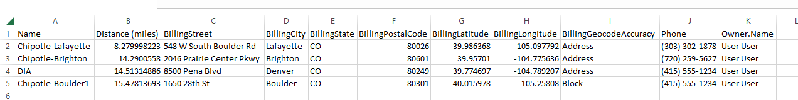

[Back To Home](index.md)

# Advanced Configuration

### Obtaining a Google API Key

[Getting Started with Google Maps Platform](https://developers.google.com/maps/gmp-get-started)

[Get Google Maps API Key](https://developers.google.com/maps/documentation/geocoding/get-api-key)

#### Using Google API Key

Paste API key into the Google box in the FirmWorks Geo Configuration screen

#### Understanding the Provide Screen

Here is a quick overview of the sections of a provider screen

**API Key** - This is th API key for needed for the geocoding integration your class is integrating with. For the Preexisting USCENSUS_GEOCODE provider you will not need an API Key.

**APEX Class Name** - This is the name of the apex class that is integrating with your geocode provider. Out of box we provide a class to integrate the with US Census API and the Google Geocoding API. The latter will only work if you have a Google Geocoding API Key which can be obtained byt following the steps [here](#obtaining-a-google-api-key).

**Is Active** -  This will mark the provider as the active geocode provider for FirmWorks Geo. Only one provider can be active at a time.

### Setting up FirmWorks Geo Custom Configurations

FirmWorks Geo Custom Configurations are made up of 4 different parts.

**FirmWorks Geo Search Configuration**

In this section you will need to do a few things to get the configuration started.

Salesforce Object Name: This is the first section you will need to set. This wills et the context for the rest of the configuration.

Options Display Name: This is the name that will show up in the FirmWorks Geo Search Component.

Latitude and Longitude Fields: In this section you will need to set three items. These will allow FirmWorks Geo to know which of hte objects Address fields you want to use for to Lat and Long.

- Geo location Field: The Compound Address field or a Geo location field that contains Lat and Long fields
- Geo location Field Latitude API Name: The API name of the Address field that contains the Latitude.
- Geo location Field Longitude API Name: The API name of the Address field that contains the Longitude.

Sort Order: The order you want to show this Configuration in the FirmWorks Geo Search component if there are more than one configurations.

Record Filters: This allows you to create one or more filters you can reference when this Configuration is chosen in the FirmWorks Geo Search component. It is made up of two parts.

- Filter Label: What you want to call the filter and what will show up in the filter selection UI in the FirmWorks Geo Search component.
- Filter Where Clause: Here you will need to put your filter criteria. It will be in the form of a SOQL Where clause, with out the Where in front. For more on SOQL please see this Salesforce Article.

https://developer.salesforce.com/docs/atlas.en-us.soql_sosl.meta/soql_sosl/sforce_api_calls_soql_select_conditionexpression.htm

**FirmWorks Geo Map Component Display Options**

This section is use to set the Label and detail value for the popup that shows when you click a map pin as see in the image below. You can choose from any of the fields from the object chosen in the FirmWorks Geo Search Configuration Section above.

**FirmWorks Geo List Component Options**

This section allows you to set the columns you see in the FirmWorks Geo List Component.

Field Name - This is the field from the Object selected in the FirmWorks Geo Search Configuration you want to source data to the column.

Label - This allows you to set a column label.

**FirmWorks Geo List Component Data Download Options**

This section will let you map the fields and columns you want to be present when the data is downloaded from the FirmWorks Geo List Component's Download button.

Field Name - This is the field from the Object selected in the FirmWorks Geo Search Configuration you want to source data to the column.

Label - This allows you to set a column label.

### Using Custom Apex to Link to a Geocode Provider

