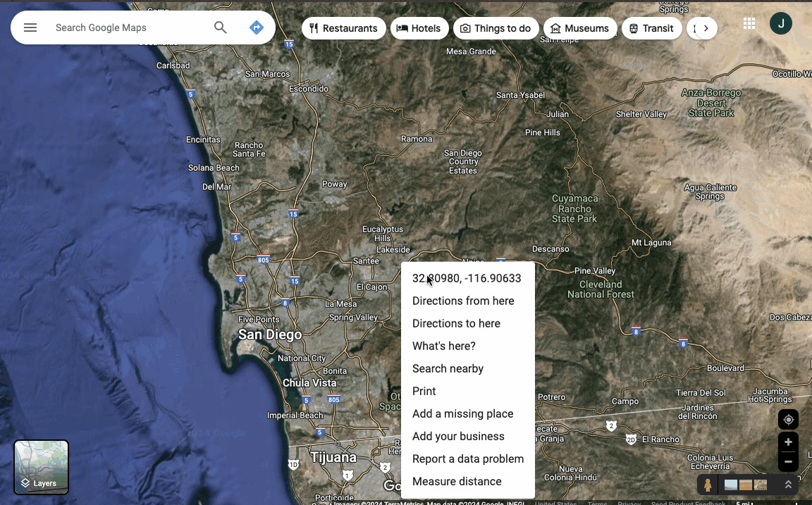

[Back To Home](index.md)

# Release Notes

## 1.7

- Added ability to clear radio selection from the list component

## 1.6

- Introduce Invocable Method to Geocode addresses via flows "Geocode an address"
- Introduce global APEX method to Geocode addresses via APEX FirmworksGeo.GeoToolkit.geocode(string address);

## 1.5

- Error handling updates to increase code coverage

## 1.4

- API Version update from 59 to 60

## 1.3

- Global modifiers added to support custom providers (Contact support about leveraging custom geo providers - for instance adding a cacheing layer on top of your google results)
- Added ability to set origin location from dropping a pin on a map. This allows for the ability to set origin locations from device (browser/phone), a record's latitude/longitude fields, lookup via US Geo/ Google Providers, and now selecting from a visual map.

## 1.2

- Flow support for components

## 1.1

- Flow support for components

## 1.0.0 March 2024
  - Due to unforseen issues with the original FirmWorks Geo package (namespace firmworks) - We have rereleased FirmWorks Geo as "FirmWorks-Geo" with it's own firmworksGeo namespace. The new package and the old package can be installed concurrently (although confusing as many things are named the same). The removal of the FirmWorks Geo package with the namespace "firmworks" is neccessary to use any other FirmWorks products.

  - Support searching from geo coordinates - easily get coordinates from a provider like Google Maps and enter it into the address field - this bypasses API call outs to geocode the address. The accepted values - are valid decimal latitudes and decimal longitudes separated by a comma.
    - 32.80979973546311, -116.906332705415
    - 38.483378, -109.681333
    - 45.019120, -76.898557
    - 0.5, 0.5

***

***

***
## Firmworks Geo with Firmworks Namespace

## 0.10 January 2024
- Added ability to limit results returned - helpful for areas where thousands of results causing performance degradation.

## 0.8 December 2023

- Updated all metadata to v59.0
- Modified firmworks__Nearby_Setting__mdt from Package Protected to public
- Modified Permission Sets to include Custom Metadata
- Introduced Interop - Component Group Alias
  - Because the search, list and map components work via client side events - adding multiple components (via tabs or other layout) resulted in inconsistent behavior.
  - The design time configuration can be set with a unique arbitrary custom value so that the search/list/map and other components can subscribe to the same group that have the same setting.
- List component now can show a driving directions button which can be turned on/off in design - this feature opens a google.com directions screen for the first 23 addresses in the list component. The url can be subsequently shared to a phone for drive navigation.
- List component can now hide the download button
- Introduced contextId in search - If adding the search component to a record layout - a filter can be set to provide subsets
  - for example the search component can be added to an account layout, it can be configured to show a contacts map and list
  - Create a filter on the Contacts Mailing Configuration - Add '(AccountId = :contextId)'
  - From within the configuration for the search component on the account layout - set the default filter list and set the filter to the one you created

## 0.5 August 2023

- Rebrand from "Nearby" to "FirmWorks Geo"

## 0.3 May 2023

### Enhancement

- Map component and List components can now be placed in tabs or other deferred rendering sections aiding with dynamic and smaller page layouts.

## 0.2 May 2023

### fixes

- Support for specifying parent relationships in configuration screen
- Minor fix for using Geo fields on a page layout

## 0.1 January 2023

- FirmWorks Geo application supports
  - Multiple ways to set searching from
    - Built in Geo Encoding using full address
    - Support for Google API key
    - Using device location
    - Record based from layout
  - List of results with download as CSV option
  - Graphical map showing multiple markers
- Extensible support for contextual record selection for custom LWC and Aura components
